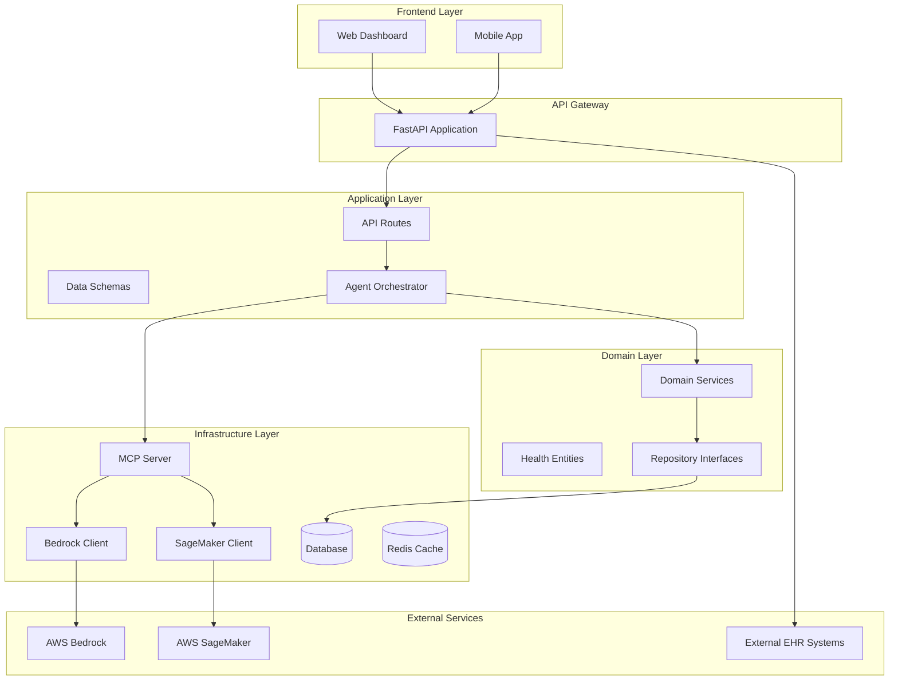

# Health Insight Agent - Design Document

## Overview

The Health Insight Agent is a cloud-native, AI-powered health analysis system built using Clean Architecture principles. The system processes health data through multiple AI agents, generates personalized insights, and provides both API and web interfaces for healthcare professionals and patients. The architecture leverages AWS services (Bedrock, SageMaker) for AI capabilities while maintaining separation of concerns through domain-driven design.

## Architecture

### High-Level Architecture



### Clean Architecture Layers

1. **Presentation Layer** (`frontend/`, `backend/app/api/`)
   - Web dashboard for health insights visualization
   - RESTful API endpoints for data access
   - Request/response schemas and validation

2. **Application Layer** (`backend/app/agents/`, `backend/app/services/`)
   - Agent orchestration and coordination
   - Use case implementations
   - External service integrations

3. **Domain Layer** (`backend/app/domain/`)
   - Core business entities and value objects
   - Domain services and business rules
   - Repository interfaces

4. **Infrastructure Layer** (`backend/app/infra/`)
   - Database implementations
   - External service clients
   - Configuration and dependency injection

## Components and Interfaces

### Core Components

#### 1. Agent Orchestrator
```python
class AgentOrchestrator:
    """Coordinates multiple AI agents for comprehensive health analysis"""
    
    async def analyze_health_data(self, health_data: HealthData) -> InsightReport:
        """Orchestrates analysis across multiple specialized agents"""
        
    async def get_agent_status(self) -> Dict[str, AgentStatus]:
        """Returns status of all registered agents"""
```

#### 2. MCP Server
```python
class MCPServer:
    """Model Context Protocol server for AI agent communication"""
    
    async def register_agent(self, agent: HealthAgent) -> None:
        """Registers a new health analysis agent"""
        
    async def execute_agent_task(self, task: AgentTask) -> AgentResponse:
        """Executes a specific analysis task through an agent"""
```

#### 3. Bedrock Client
```python
class BedrockClient:
    """AWS Bedrock service interface for LLM operations"""
    
    async def generate_insights(self, prompt: str, context: Dict) -> str:
        """Generates natural language health insights"""
        
    async def analyze_symptoms(self, symptoms: List[str]) -> SymptomAnalysis:
        """Analyzes symptoms using foundation models"""
```

#### 4. SageMaker Client
```python
class SageMakerClient:
    """AWS SageMaker service interface for ML model operations"""
    
    async def predict_risk_factors(self, health_metrics: HealthMetrics) -> RiskAssessment:
        """Predicts health risks using trained ML models"""
        
    async def detect_anomalies(self, time_series_data: TimeSeriesData) -> AnomalyReport:
        """Detects anomalies in health data patterns"""
```

### Domain Entities

#### Health Data Models
```python
@dataclass
class HealthData:
    patient_id: str
    vitals: VitalSigns
    lab_results: List[LabResult]
    symptoms: List[Symptom]
    medical_history: MedicalHistory
    timestamp: datetime

@dataclass
class InsightReport:
    report_id: str
    patient_id: str
    insights: List[HealthInsight]
    risk_assessment: RiskAssessment
    recommendations: List[Recommendation]
    confidence_score: float
    generated_at: datetime
```

### API Interfaces

#### Health Data Endpoints
```python
# POST /api/v1/health-data
async def upload_health_data(health_data: HealthDataSchema) -> HealthDataResponse

# GET /api/v1/insights/{patient_id}
async def get_patient_insights(patient_id: str) -> InsightReportResponse

# POST /api/v1/analyze
async def analyze_health_data(analysis_request: AnalysisRequest) -> AnalysisResponse

# GET /api/v1/dashboard/{patient_id}
async def get_dashboard_data(patient_id: str) -> DashboardResponse
```

## Data Models

### Database Schema

#### Health Data Storage
```sql
-- Patients table
CREATE TABLE patients (
    id UUID PRIMARY KEY,
    external_id VARCHAR(255) UNIQUE,
    created_at TIMESTAMP,
    updated_at TIMESTAMP
);

-- Health records table
CREATE TABLE health_records (
    id UUID PRIMARY KEY,
    patient_id UUID REFERENCES patients(id),
    data_type VARCHAR(50),
    raw_data JSONB,
    processed_data JSONB,
    created_at TIMESTAMP
);

-- Insight reports table
CREATE TABLE insight_reports (
    id UUID PRIMARY KEY,
    patient_id UUID REFERENCES patients(id),
    report_data JSONB,
    confidence_score FLOAT,
    status VARCHAR(20),
    created_at TIMESTAMP
);
```

#### Caching Strategy
- **Redis Cache**: Store frequently accessed insights and dashboard data
- **TTL**: 1 hour for insights, 15 minutes for real-time dashboard data
- **Cache Keys**: `insights:{patient_id}`, `dashboard:{patient_id}`, `analysis:{request_hash}`

## Error Handling

### Error Categories and Responses

#### 1. Data Validation Errors
```python
class HealthDataValidationError(Exception):
    """Raised when health data fails validation"""
    
    def __init__(self, field: str, message: str):
        self.field = field
        self.message = message
```

#### 2. AI Service Errors
```python
class AIServiceError(Exception):
    """Base class for AI service related errors"""
    
class BedrockServiceError(AIServiceError):
    """Bedrock service unavailable or rate limited"""
    
class SageMakerServiceError(AIServiceError):
    """SageMaker model inference failed"""
```

#### 3. Circuit Breaker Pattern
```python
class CircuitBreaker:
    """Implements circuit breaker for external service calls"""
    
    async def call_with_circuit_breaker(self, service_call: Callable) -> Any:
        """Executes service call with circuit breaker protection"""
```

### Error Response Format
```json
{
    "error": {
        "code": "VALIDATION_ERROR",
        "message": "Invalid health data format",
        "details": {
            "field": "vitals.heart_rate",
            "reason": "Value must be between 40 and 200"
        },
        "timestamp": "2024-01-15T10:30:00Z"
    }
}
```

## Testing Strategy

### Testing Pyramid

#### 1. Unit Tests (70%)
- Domain entity validation
- Business logic in domain services
- Individual component functionality
- Mock external dependencies

#### 2. Integration Tests (20%)
- API endpoint testing
- Database integration
- External service integration (with test doubles)
- Agent orchestration workflows

#### 3. End-to-End Tests (10%)
- Complete user workflows
- Dashboard functionality
- Real-time data updates
- Cross-service communication

### Test Data Management
```python
class HealthDataFactory:
    """Factory for generating test health data"""
    
    @staticmethod
    def create_sample_health_data() -> HealthData:
        """Creates realistic test health data"""
        
    @staticmethod
    def create_edge_case_data() -> List[HealthData]:
        """Creates edge case scenarios for testing"""
```

### Performance Testing
- **Load Testing**: 1000 concurrent users analyzing health data
- **Stress Testing**: Peak load scenarios with degraded AI services
- **Response Time**: 95th percentile under 30 seconds for analysis
- **Throughput**: 100 analyses per minute minimum

## Security Considerations

### Data Protection
- **Encryption**: AES-256 for data at rest, TLS 1.3 for data in transit
- **PII Handling**: Tokenization of sensitive patient identifiers
- **Access Control**: Role-based access with JWT tokens
- **Audit Logging**: Comprehensive audit trail for all data access

### AI Model Security
- **Input Sanitization**: Validate and sanitize all inputs to AI models
- **Output Filtering**: Filter AI responses for sensitive information
- **Model Versioning**: Track and validate AI model versions
- **Prompt Injection Protection**: Implement safeguards against prompt injection attacks

## Deployment Architecture

### Containerization
```dockerfile
# Multi-stage build for backend
FROM python:3.11-slim as backend
WORKDIR /app
COPY requirements.txt .
RUN pip install -r requirements.txt
COPY . .
EXPOSE 8000
CMD ["uvicorn", "app.main:app", "--host", "0.0.0.0", "--port", "8000"]
```

### Infrastructure as Code
```python
# CDK deployment configuration
class HealthInsightStack(Stack):
    def __init__(self, scope: Construct, construct_id: str, **kwargs):
        super().__init__(scope, construct_id, **kwargs)
        
        # ECS Fargate service
        # RDS PostgreSQL database
        # ElastiCache Redis cluster
        # Application Load Balancer
        # CloudWatch monitoring
```

### Monitoring and Observability
- **Metrics**: Custom CloudWatch metrics for analysis performance
- **Logging**: Structured logging with correlation IDs
- **Tracing**: AWS X-Ray for distributed tracing
- **Alerting**: CloudWatch alarms for system health and performance