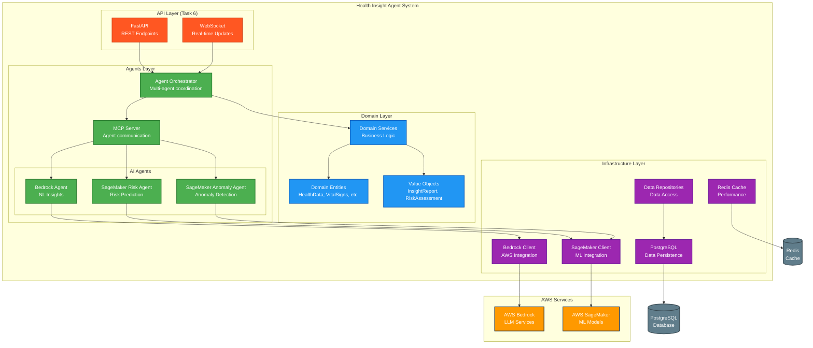
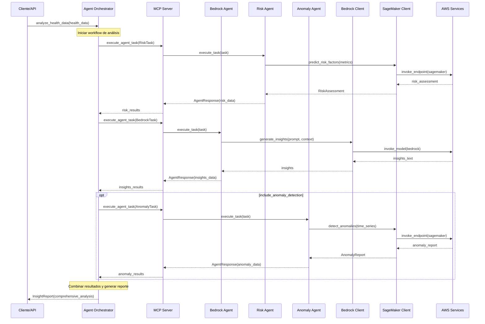

# Health Insight Agent - Diagrama de Arquitectura

## Arquitectura General del Sistema



## Flujo de Comunicación Detallado



## Estructura de Directorios Actual

```
backend/
├── app/
│   ├── agents/                    # Capa de Agentes (Task 5 ✅)
│   │   ├── __init__.py           # Exports principales
│   │   ├── base.py               # Interfaces base y registry
│   │   ├── mcp_server.py         # Servidor MCP
│   │   ├── bedrock_agent.py      # Agente Bedrock
│   │   ├── sagemaker_agent.py    # Agentes SageMaker
│   │   └── orchestrator.py       # Orquestador principal
│   │
│   ├── domain/                   # Capa de Dominio (Tasks 1-2 ✅)
│   │   ├── entities.py           # Entidades de negocio
│   │   ├── value_objects.py      # Objetos de valor
│   │   └── services.py           # Servicios de dominio
│   │
│   ├── infra/                    # Capa de Infraestructura (Tasks 3-4 ✅)
│   │   ├── database.py           # Configuración DB
│   │   ├── models.py             # Modelos SQLAlchemy
│   │   ├── repositories.py       # Repositorios de datos
│   │   ├── cache.py              # Cliente Redis
│   │   ├── aws_bedrock.py        # Cliente Bedrock
│   │   └── aws_sagemaker.py      # Cliente SageMaker
│   │
│   └── core/                     # Configuración central
│       └── config.py             # Settings de la aplicación
│
├── alembic/                      # Migraciones de DB
└── tests/                        # Tests del sistema
```

## Dependencias Entre Componentes

### 1. **Agents Layer** (Nivel más alto)
- **Orchestrator** → MCP Server → Individual Agents
- **Agents** → Infrastructure Clients → AWS Services
- **Agents** → Domain Services → Domain Entities

### 2. **Domain Layer** (Lógica de negocio)
- **Services** → Entities + Value Objects
- **Entities** ← Value Objects (composición)

### 3. **Infrastructure Layer** (Servicios externos)
- **AWS Clients** → AWS Services (Bedrock, SageMaker)
- **Repositories** → Database (PostgreSQL)
- **Cache** → Redis

## Patrones de Diseño Implementados

### 1. **Agent Pattern**
- Agentes autónomos especializados
- Comunicación a través de MCP Server
- Registro y descubrimiento de agentes

### 2. **Orchestrator Pattern**
- Coordinación de múltiples agentes
- Workflow de análisis configurable
- Síntesis de resultados

### 3. **Circuit Breaker Pattern**
- Resilencia en clientes AWS
- Manejo de fallos temporales
- Recuperación automática

### 4. **Repository Pattern**
- Abstracción de acceso a datos
- Separación de persistencia y dominio

### 5. **Domain-Driven Design (DDD)**
- Entidades y objetos de valor
- Servicios de dominio
- Separación clara de capas

## Estado de Implementación

| Componente | Estado | Tarea |
|------------|--------|-------|
| Domain Entities | ✅ Completo | Task 1 |
| Domain Services | ✅ Completo | Task 2 |
| Database & Models | ✅ Completo | Task 3 |
| AWS Clients | ✅ Completo | Task 4 |
| Agent Orchestration | ✅ Completo | Task 5 |
| API Layer | 🔄 Pendiente | Task 6 |
| Integration Tests | 🔄 Pendiente | Task 7 |

## Próximos Pasos (Task 6)

La siguiente tarea implementará la **API Layer** que incluirá:

1. **FastAPI Application** - Endpoints REST
2. **WebSocket Support** - Actualizaciones en tiempo real
3. **API Routes** - Endpoints para análisis de salud
4. **Request/Response Models** - Validación de datos
5. **Error Handling** - Manejo de errores HTTP
6. **Authentication** - Seguridad básica

Esta capa se conectará directamente con el **Agent Orchestrator** para proporcionar una interfaz externa al sistema.